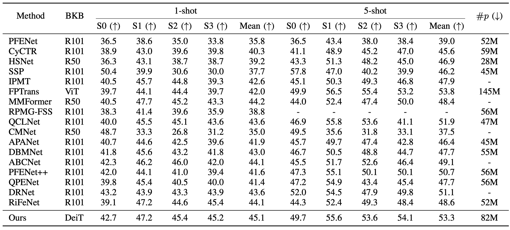

# [TCSVT] Concept-Level Semantic Transfer and Context-Level Distribution Modeling for Few-Shot Segmentation

The implementation of the paper [Concept-Level Semantic Transfer and Context-Level Distribution Modeling for Few-Shot Segmentation(http:)]

_Abstract_:
Few-shot segmentation (FSS) methods aim to segment objects using only a few pixel-level annotated samples. 
Current approaches either derive a generalized class representation from support samples to guide the segmentation of query samples, which often discards crucial spatial contextual information, or rely heavily on spatial affinity between support and query samples, without adequately summarizing and utilizing the core information of the target class. Consequently, the former struggles with fine detail accuracy, while the latter tends to produce errors in overall localization.
To address these issues, we propose a novel FSS framework, CCFormer, which balances the transmission of core semantic concepts with the modeling of spatial context, improving both macro and micro-level segmentation accuracy. Our approach introduces three key modules: (1) the Concept Perception Generation (CPG) module, which leverages pre-trained category perception capabilities to capture high-quality core representations of the target class; (2) the Concept-Feature Integration (CFI) module, which injects the core class information into both support and query features during feature extraction; and (3) the Contextual Distribution Mining (CDM) module, which utilizes a Brownian Distance Covariance matrix to model the spatial-channel distribution between support and query samples, preserving the fine-grained integrity of the target.
Experimental results on the PASCAL-$5^i$ and COCO-$20^i$ datasets demonstrate that CCFormer achieves state-of-the-art performance, with visualizations further validating its effectiveness. Our code is available at \href{https://github.com/lourise/ccformer}{github.com/lourise/ccformer}.

## Framework

The framework of CCFormer.

The illustration of CDM.
## Installation
python==3.8.16
pytorch==1.8.0
opencv-python==4.7.0.72
numpy==1.24.3
CUDA==11.2

## Getting Start
### Project organization
```bash
├── data
|    ├── coco
|    |   ├── annotations
|    |   ├── images
|    |   ├── train2014
|    |   ├── val2014
|    |   └── create_masks.py
|    └── pascal
|        └── VOCdevkit
|            └── VOC2012
|                ├── base_annotations
|                ├── SegmentationClassAug
|                ├── ImageSets
|                └── JPEGImages
└──CCFormer
    ├── config
    ├── core
    ├── lists
    ├── exp
    ├── initmodel
    ├── model
    ├── utils
    ├── constants.py
    ├── train.py
    └── test.py

```

## Data Preparation

 Please follow the tips to download the processed datasets:
1. PASCAL-5i: Please refer to [PFENet](https://github.com/dvlab-research/PFENet) to prepare the PASCAL dataset for few-shot segmentation.
2. COCO-20i: Please download [COCO2017](https://cocodataset.org/#download) dataset from here. Put or link the dataset to ../data/coco.

### Training
To train on Pascal VOC, run the following command:
```bash
python train.py --config=config/pascal/pascal_split0.yaml
```
### Testing
We privode the [trained model](https://drive.google.com/drive/folders/1JAGkDEZXkylMRwrgaV27VXcY3eBiFxET?usp=sharing) on Pascal VOC and COCO datasets.
Download the model and place it in the './exp/[dataset]/CCFormer/DeiT-B/16-384/snapshot' folder.
Then, to test the model, run the following command:
```bash
python test.py
```

## Performance
### Pascal VOC

The performance of CCFormer on Pascal-5i dataset.


The performance of CCFormer in different backbones under 1-shot setting.

### COCO

The performance of CCFormer on COCO-20i dataset.


## Citation
```
@ARTICLE{luo2025concept,
  author={Luo, Yuxuan and Chen, Jinpeng and Cong, Runmin and Ip, Horace Ho Shing and Kwong, Sam},
  journal={IEEE Transactions on Circuits and Systems for Video Technology}, 
  title={Concept-Level Semantic Transfer and Context-Level Distribution Modeling for Few-Shot Segmentation}, 
  year={2025},
  volume={},
  number={},
  pages={},
  keywords={Semantics;Context modeling;Accuracy;Training;Semantic segmentation;Transformers;Location awareness;Visualization;Transformer cores;Measurement;Semantic Segmentation;Few-shot Learning;Few-shot Segmentation},
  doi={10.1109/TCSVT.2025.3554013}}
```

## Acknowledgement
This code is based on the implementation of [FPTrans](https://github.com/Jarvis73/FPTrans/tree/main)
and [DeepBDC](https://github.com/Jarvis73/FPTrans/tree/main). Thanks for their contribution.
